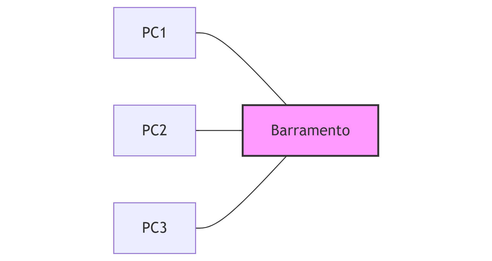

    PC1 --- Barramento
    PC2 --- Barramento
    PC3 --- Barramento


```python
from mininet.net import Mininet
from mininet.node import Controller, OVSKernelSwitch
from mininet.cli import CLI
from mininet.log import setLogLevel

def barramento_simulado():
    net = Mininet(controller=Controller, switch=OVSKernelSwitch)

    print("*** Criando os hosts")
    h1 = net.addHost('h1', ip = '10.0.0.1/8')
    h2 = net.addHost('h2', ip = '10.0.0.2/8')
    h3 = net.addHost('h3', ip = '10.0.0.3/8')

    print("*** Criando o switch (como barramento)")
    s1 = net.addSwitch('s1')

    print("*** Criando links")
    net.addLink(h1, s1)
    net.addLink(h2, s1)
    net.addLink(h3, s1)

    print("*** Inicializando a rede")
    net.start()

    print("*** Testando a conexão")
    net.pingAll()

    print("*** Rodando CLI")
    CLI(net)

    print("*** Finalizando a rede")
    net.stop()

if __name__ == '__main__':
    setLogLevel('info')
    barramento_simulado()


